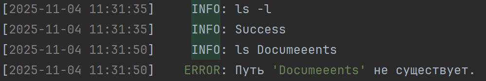

## Лабораторная работа №2

# Тема: Мини-оболочка с файловыми командами

Реализована имитация командной строки на Python с поддержкой файловых операций:

- Создание/удаление/переименование файлов и каталогов
- Навигация по файловой системе
- Копирование и перемещение файлов
- Просмотр содержимого каталогов

Ведется логгирование всех действий и ошибок.
Оболочка обрабатывает относительные и абсолютные пути, корректно обрабатывает исключения

## Структура

 <pre>
    laba2_mai/
├── src/
│   ├── commands/
│   │   ├── __init__.py
│   │   ├── cat.py
│   │   ├── cd.py
│   │   ├── cp.py
│   │   ├── grep.py
│   │   ├── ls.py
│   │   ├── mv.py
│   │   ├── rm.py
│   │   └── zip_and_tar.py
│   ├── __init__.py
│   ├── logger.py
│   ├── main.py
│   └── shell.log
├── tests/
│   ├── __init__.py
│   ├── conftest.py
│   ├── test_cat.py
│   ├── test_cd.py
│   ├── test_cp.py
│   ├── test_grep.py
│   ├── test_ls.py
│   ├── test_mv.py
│   ├── test_rm.py
│   └── test_zip_and_tar.py
├── .venv/
├── .gitignore
├── .pre-commit-config.yaml
├── pyproject.toml
├── README.md
├── requirements.txt
├── uv.lock
└── img_1.png
</pre>

## Как это работает?

При запуске программы пользователь видит имитацию командной строки, куда может вводить команды для выполнения файловых
операций. Основной цикл программы «Main» начинает обрабатывать введенную строку. Он разбивает её на составляющие, где
первое слово принимается за имя команды, а все последующие — за её аргументы. Далее программа сверяет эту извлеченную
команду со внутренним словарем поддерживаемых операций. Если введенное слово совпадает с одной из известных команд,
управление перенаправляется на соответствующий этой команде исполняемую функцию. Система надежно обрабатывает
ошибки,любые внезапные исключения, которые могут возникнуть в процессе выполнения команды, перехватываются. Тексты
сообщений ошибок были взяты из стандартных выводов командной строки ос Windows.

## Логгирование

Все введение операции логируются в формате:

В случае успешного выполнения команды в файл shell.log с флагом INFO записывается положительный результат - Success. В
случае ошибки в файл логируется вывод этой проблемы.

## Какие именно команды были реализованы?

### 1. Команда `ls`

Отображение списка файлов и каталогов в текущей директории. Поддерживается опция `-l`, флаг, который будет указывать на
необходимость вызова подробных данных о файле: права доступа, время изменения, размер, имя файла.

### 2. Команда `cd`

Команда, позволяющая переходить в указанный каталог. Поддерживается переход в родительский каталог «`cd ~`» и переход на
уровень выше «`cd ..`».

### 3. Команда `cat`

Команда предназначена для вывода содержимого указанного файла в консоль. В случае не соответствия формата файла будет
вызвана ошибка.

### 4. Команда `cp`

Команда предназначена для копирования файлов и каталогов. С её помощью можно скопировать файл из исходного расположения
в указанное место назначения. При использовании опции `-r` команда выполняет рекурсивное копирование, тем самым копируя
целые каталоги вместе со всем их содержимым и метаданными.

### 5. Команда `mv`

Команда для перемещения файлов или каталогов в новое место, а также для их переименования. Она позволяет перемещать
объекты в существующие каталоги, автоматически проверяя перед выполнением, существует ли исходный файл или каталог и
есть ли у пользователя необходимые права доступа для операции.

### 6. Команда `rm`

Команда для удаления указанных файлов или папок. Поддерживает опцию `-r` для рекурсивного удаления каталога вместе со
всем их содержимым. При удалении каталогов программа обязательно запрашивает подтверждение операции (y/n). Команда не
может удалить корневой или родительский каталог.

### 7. Команда `zip/unzip`

Команда `zip` создает ZIP-архив из указанного каталога, упаковывая все его содержимое в сжатый файл с заданным именем.
Команда `unzip` распаковывает содержимое указанного ZIP-архива в текущую рабочую директорию, восстанавливая исходную
структуру файлов и папок.

### 8. Команда `tar/untar`

Команда `tar` создает TAR-архив, содержащий структуру каталогов и файлов без сжатия. Дальше файл дополнительно сжимается
с помощью Gzip, что и образует окончательный формат `tar.gz`. Команда `untar` выполняет обратную операцию и извлекает
содержимое в текущую директорию.

### 9. Команда `grep`

Команда предназначена для поиска текстовых шаблонов в файлах. Она выполняет поиск строк, соответствующих указанному
шаблону с помощью библиотеки re. С опцией `-r` поиск становится рекурсивным и программа будет искать совпадения во всех
файлах указанной директории и её подкаталогах. Поддерживает опцию `-i`, что позволяет выполнять поиск без учёта регистра
символов.Возможно использование двух флагов одновременно в формате `-ri` или `-ir`.
